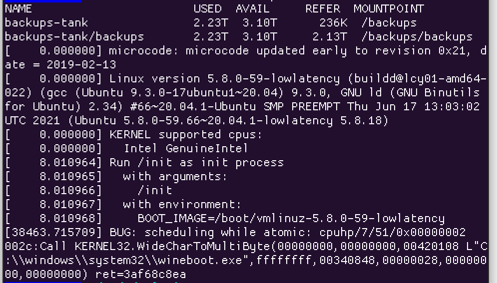
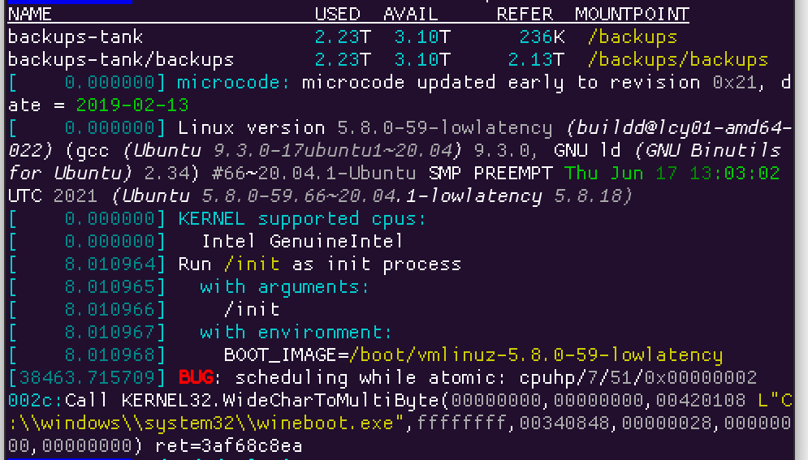

# colorit

Hairy script to colorize/prettyprint any text you pipe into it.

Mostly designed for monitoring logs and diagnostic output, but it has a good stab at doing an okay job when you throw random stuff at it.

